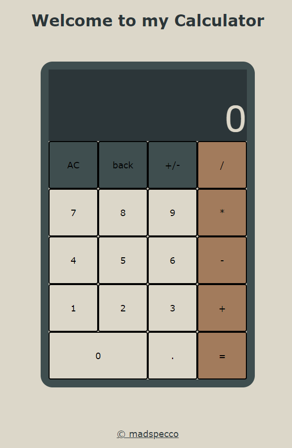

# Calculator

## Links
* [Try The Website here!](https://madspecco.github.io/calculator/)
* [Link to Assignment](https://www.theodinproject.com/lessons/foundations-calculator)

# About
This website acts as a simple pocket calculator with basic mathematical operations such as:
- addition
- subtraction
- multiplication
- division

Some other features:

- Keyboard Support
- Backspace Button
- Floating Point Numbers
- Negative Number Switch
- Looks nice

# Overview
